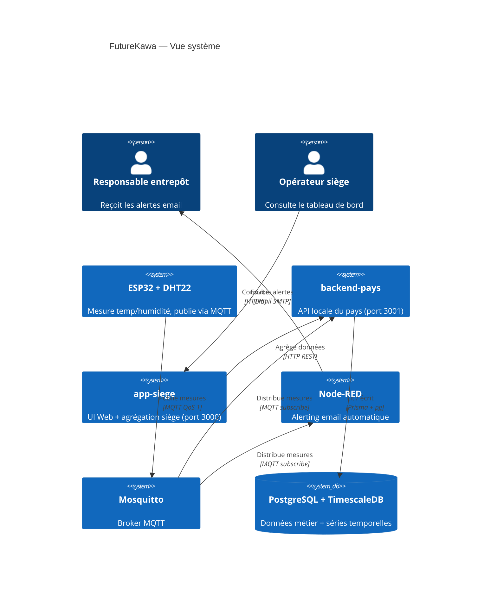
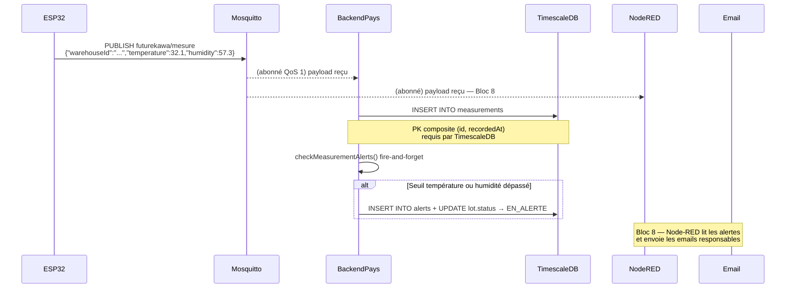
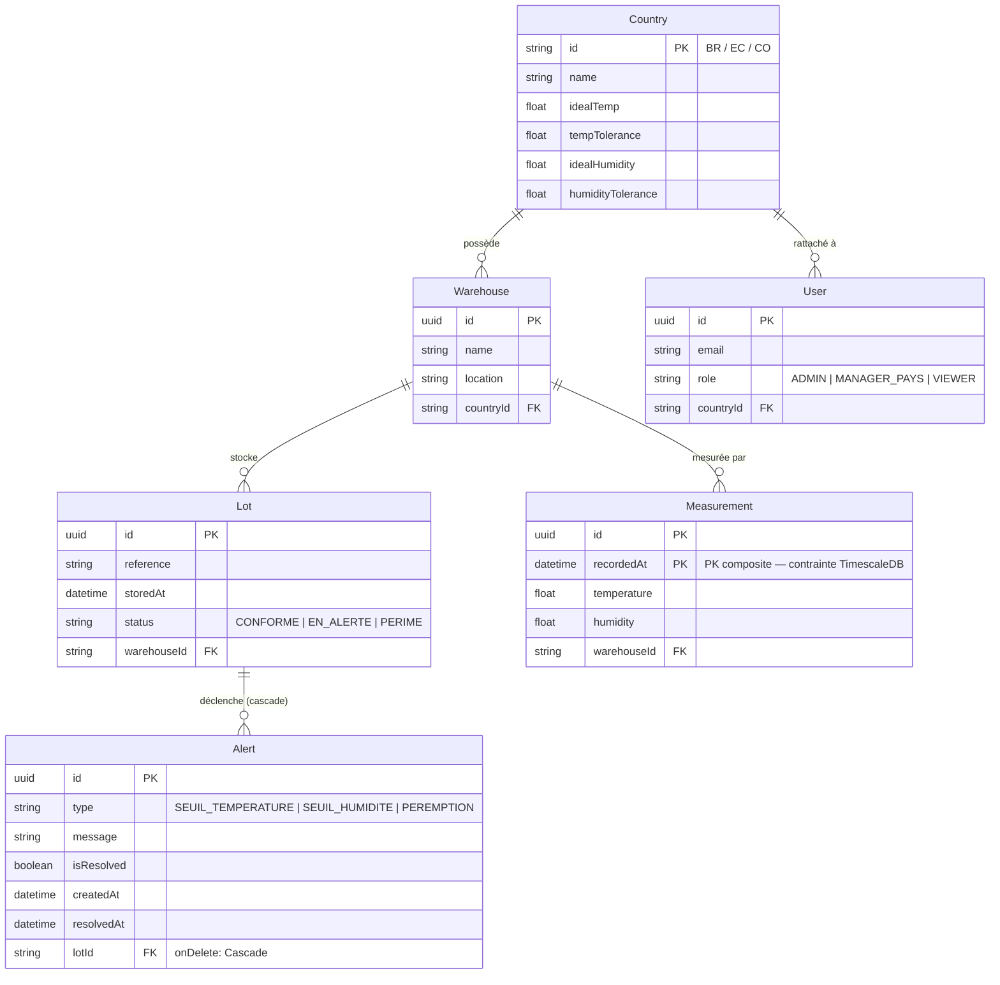
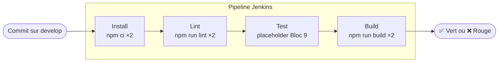
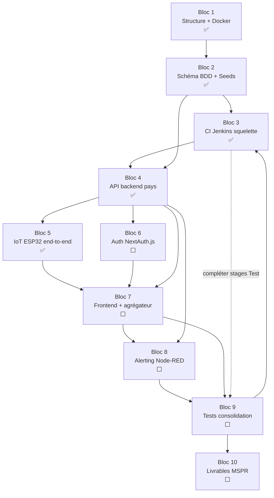

# Guide technique — FutureKawa

Document pédagogique évolutif. Mis à jour à chaque bloc.
Objectif : permettre à quelqu'un d'extérieur au projet de tout comprendre en partant de zéro.

---

## 1. Contexte et objectif

### Le problème métier

FutureKawa est une entreprise de caféiculture présente dans trois pays : **Brésil, Équateur, Colombie**. Elle perd de l'argent à cause de lots de café dégradés en entrepôt :
- Température et humidité mal maîtrisées (variations saisonnières non détectées)
- Lots trop anciens oubliés en stock (dépassement de la date limite)
- Siège sans visibilité en temps réel sur ce qui se passe dans les entrepôts

### Ce qu'on construit

Une **plateforme IoT de surveillance** qui :
1. Mesure en continu la température et l'humidité dans chaque entrepôt (capteur ESP32)
2. Déclenche des alertes email automatiques en cas de dépassement de seuil
3. Alerte sur les lots proches de péremption (> 365 jours)
4. Donne une vision centralisée au siège (tableau de bord multi-pays)

### Les seuils par pays

| Pays | Temp. idéale | Tolérance | Humidité idéale | Tolérance |
|---|---|---|---|---|
| Brésil | 29°C | ±3°C | 55% | ±2% |
| Équateur | 31°C | ±3°C | 60% | ±2% |
| Colombie | 26°C | ±3°C | 80% | ±2% |

---

## 2. Architecture globale

### Vue d'ensemble (C4 — Niveau 1)



### Principe de distribution

Chaque pays est **autonome**. Si le réseau entre le Brésil et le siège coupe, le backend brésilien continue d'enregistrer les mesures. Le siège consolide quand la connexion revient.

**Règle fondamentale :** le siège n'accède **jamais** directement à la base de données d'un pays. Il passe toujours par l'API REST du `backend-pays`.

```
[ESP32] → MQTT → [backend-pays :3001] ←→ [PostgreSQL/TimescaleDB]
                        ↑ API REST
              [app-siege :3000] = UI + agrégateur siège
```

---

## 3. Flux de données

### Chemin d'une mesure IoT



### Topic MQTT

```
futurekawa/mesure
```

Topic unique pour toutes les mesures de tous les pays. L'entrepôt est identifié par le champ `warehouseId` dans le payload — pas dans le topic. Le broker distribue le même message au `backend-pays` ET à Node-RED simultanément.

### Format du payload

```json
{
  "warehouseId": "00000000-0000-0000-0000-000000000001",
  "temperature": 29.4,
  "humidity":    54.8
}
```

Le backend-pays détermine le pays et les seuils en lisant l'entrepôt depuis la BDD (`warehouse.country.idealTemp`…).

---

## 4. Modèle de données



### Pourquoi PostgreSQL + TimescaleDB ?

- **PostgreSQL** gère les données métier relationnelles (lots, entrepôts, alertes, users)
- **TimescaleDB** transforme la table `measurements` en **hypertable** : elle se découpe automatiquement en chunks temporels. Avec un capteur qui émet toutes les 30 secondes, on accumule des millions de lignes. Les requêtes `WHERE recorded_at BETWEEN ...` restent rapides.

Ce ne sont pas deux bases différentes — TimescaleDB est une **extension PostgreSQL**. Même image Docker, même connexion, même SQL.

---

## 5. Couche IoT

### Principe de découplage

Le firmware ESP32 et le backend sont **totalement découplés** — ils ne se connaissent pas. Leur seul point de contact est le contrat MQTT :

```
Topic   : futurekawa/mesure
Payload : {"warehouseId": "...", "temperature": 29.4, "humidity": 54.8}
```

Changer de matériel (DHT22 → SHT31, ESP32 → Raspberry Pi) = modifier le firmware uniquement. Le backend ne change pas.

### Firmware ESP32 (`iot/esp32/`)

Deux fichiers :

| Fichier | Rôle |
|---|---|
| `config.h` | Tout ce qui change par déploiement : WiFi, IP broker, warehouseId, type capteur |
| `futurekawa_sensor.ino` | Logique fixe : WiFi + MQTT + lecture capteur + publication JSON |

Adaptation à un nouveau capteur = décommenter une ligne dans `config.h` + ajouter un `#ifdef` dans le `.ino`. Le reste est inchangé.

### Simulateur Python (`iot/simulation/simulate_sensor.py`)

Remplace l'ESP32 pour les tests et la démo jury :

```bash
# Mesures dans les seuils (aucune alerte)
python simulate_sensor.py --country BR

# Mesures hors seuils (déclenche SEUIL_TEMPERATURE + SEUIL_HUMIDITE)
python simulate_sensor.py --country BR --scenario hors-seuil --count 5

# Cas limite (exactement à la frontière ±3°C / ±2%)
python simulate_sensor.py --scenario limite
```

### Cycle de vie d'une mesure (de l'ESP32 à l'alerte)

```
ESP32 lit DHT22
    ↓ JSON publié sur futurekawa/mesure (MQTT QoS 1)
Worker mqtt-worker.ts reçoit
    ↓ INSERT measurements (TimescaleDB)
    ↓ checkMeasurementAlerts() [fire-and-forget]
        → compare avec country.idealTemp ± tempTolerance
        → si violation → INSERT alert + UPDATE lot.status = EN_ALERTE
```

---

## 6. Pipeline CI/CD

### Structure du Jenkinsfile



### Pourquoi pipeline as code ?

Le `Jenkinsfile` est versionné dans le repo Git comme n'importe quel fichier source. Avantages :
- Le pipeline évolue avec le code (une PR pour modifier un stage = une review normale)
- Reproductible sur n'importe quel serveur Jenkins
- Historique des changements dans `git log`

### Pourquoi npm ci et pas npm install ?

`npm install` peut modifier `package-lock.json` si des versions ont changé. En CI, on veut **exactement** ce qui est décrit dans le lock file, rien de plus. `npm ci` supprime `node_modules` et réinstalle depuis zéro — builds reproductibles garantis.

### Pourquoi séquentiel pour le squelette ?

Quand un stage échoue en séquentiel, les logs sont propres et dans l'ordre — on sait immédiatement quelle app a planté à quel stage. Le parallèle (deux apps en simultané dans le même stage) sera ajouté au Bloc 9 quand les tests seront réels et que le temps de pipeline justifiera la complexité.

### Prérequis Jenkins

Le bloc `tools { nodejs 'node-20' }` requiert :
1. Le **plugin NodeJS** installé dans Jenkins
2. Un outil nommé `node-20` configuré dans *Manage Jenkins > Tools > NodeJS installations*

---

## 7. Cheminement de développement

La roadmap suit une logique de dépendances stricte : chaque bloc s'appuie sur les précédents.



**Pourquoi cet ordre ?**
- Bloc 2 avant Bloc 4 : l'API ne peut pas exister sans schéma DB
- Bloc 6 avant Bloc 7 : chaque route frontend doit être protégée dès l'écriture
- Bloc 3 tôt : tout commit sur `develop` est vérifié automatiquement dès le début

---

## 8. Décisions clés et leur pourquoi

### Next.js pour un backend API pur

Next.js sert habituellement à faire des sites web. Ici on utilise ses **Route Handlers** (`app/api/route.ts`) comme API REST pure dans `backend-pays/`. Raison : une seule stack TypeScript pour tout le projet, types partagés via `shared/types/`, une seule chaîne de build. Le surcoût mémoire est négligeable en prototype.

### UUID natif plutôt que SERIAL

Les IDs auto-générés utilisent le type PostgreSQL natif `UUID` avec `gen_random_uuid()`. Alternative écartée : `SERIAL` (entier auto-incrémenté) produirait des collisions certaines en architecture distribuée — le Brésil générerait ID=1, la Colombie aussi, et l'agrégateur siège ne pourrait pas distinguer les deux.

### PK composite sur Measurement

TimescaleDB découpe physiquement `measurements` en chunks temporels. Une PRIMARY KEY doit être unique *au sein de chaque chunk*. Sans inclure la colonne temporelle (`recordedAt`), l'unicité ne peut pas être garantie. D'où : `PRIMARY KEY (id, recordedAt)`.

### MongoDB écarté

MongoDB aurait sa place pour stocker les payloads MQTT bruts en production. Mais le sujet impose SQL et TimescaleDB couvre le cas d'usage des séries temporelles. L'ADR-0001 documente ce choix comme **dette consciente** — MongoDB est mentionné pour la phase 2.

---

## 9. Pour aller plus loin

- `doc/adr/` — Décisions architecturales détaillées (ADR-0001 à ADR-0009)
- `doc/glossaire.md` — Définitions de tous les termes techniques
- `backend-pays/prisma/schema.prisma` — Schéma complet de la base de données
- `Jenkinsfile` — Pipeline CI/CD complet
- `docker-compose.yml` — Stack Docker complète
